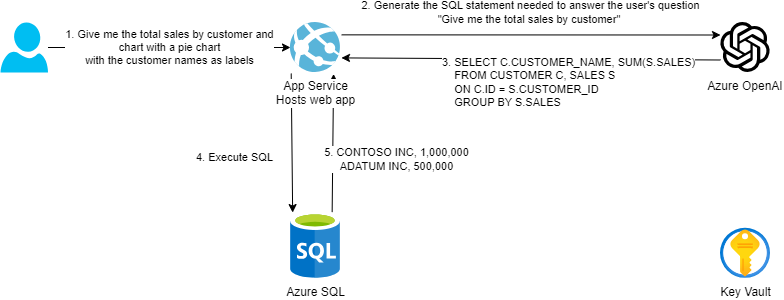

# Azure OpenAI Assistants Demo - SQL Chat

Attached here is code for a sample Streamlit application which can be used to demonstrate a pattern for conversational interaction with a SQL Database.

Briefly, we showcase how to utilize the Azure OpenAI Assistants API (specifically, the Function Calling & Code Interpreter capabilities) to retrieve schema for a target SQL database - in our testing we utilized the AdventureWorks Database deployed into a lightweight Azure SQL Database - then to assemble and execute SQL queries and provide text-based and graphical responses



## Disclaimer

**THE SOFTWARE IS PROVIDED "AS IS", WITHOUT WARRANTY OF ANY KIND, EXPRESS OR IMPLIED, INCLUDING BUT NOT LIMITED TO THE WARRANTIES OF MERCHANTABILITY, FITNESS FOR A PARTICULAR PURPOSE AND NONINFRINGEMENT. IN NO EVENT SHALL THE AUTHORS OR COPYRIGHT HOLDERS BE LIABLE FOR ANY CLAIM, DAMAGES OR OTHER LIABILITY, WHETHER IN AN ACTION OF CONTRACT, TORT OR OTHERWISE, ARISING FROM, OUT OF OR IN CONNECTION WITH THE SOFTWARE OR THE USE OR OTHER DEALINGS IN THE SOFTWARE.**

## Prerequisites

- [Azure CLI](https://docs.microsoft.com/en-us/cli/azure/install-azure-cli)
- [Azure Developer CLI](https://learn.microsoft.com/en-us/azure/developer/azure-developer-cli/overview)
- Azure subscription & resource group
- [Python 3.12](https://www.python.org/downloads/) - needed if running locally

### Setup

Running this demo successfully requires having access to a SQL database which can be reached from a client machine using traditional SQL Authentication via the `pyodbc` library. For our development purposes, we utilized an Azure SQL Database loaded with the AdventureWorks dataset - this can be deployed directly from the Azure portal, and you can whitelist the IP address of the client machine running the demo.

Further, you will need to have an instance of Azure OpenAI deployed in a region which supports the Assistants API. The system message and functions associated with the deployment can be found in `assistants_sys_msg.txt`, `get_sql_db_schema.json`, and `query_sql_db.json`.

Create an updated `.env` with values from your SQL/Azure OpenAI resources using `sample.env` as a template.

### Running the Application locally

To start the Streamlit SQL Chat Application run the following command:

```shell
cd src

python -m venv ./.venv

./.venv/Scripts/activate

python -m pip install -r .\requirements.txt

python -m streamlit run app_assistants.py
```

### Deploy to Azure

Run the following command to deploy the entire solution to Azure.

```shell
azd up
```